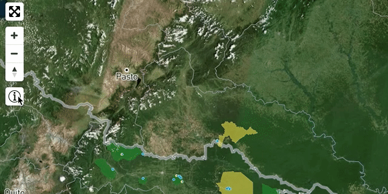

# mapbox-gl-toggle-control

[![npm version][0]][1]

Add a toggle control to your Mapbox GL Map that has the look and feel of other Mapbox GL controls. When clicked, the given HTMLElement will appear or disappear.


```npm install mapbox-gl-toggle-control```

[]()

## Example

```js
var mapbox = require('mapbox-gl')
var ToggleControl = require('mapbox-gl-toggle-control')

var map = new mapboxgl.Map({
  container: 'map', // container id
  zoom: 5.5, // starting zoom
  maxBounds: [-87, -9, -70, 6]
})

var toggle = new ToggleControl(document.querySelector('#my-legend'))
map.addControl(toggle, 'top-left')
```

```html
<style>
  .mapboxgl-ctrl-toggle {
    background-image: url(/icons/my-toggle-button.svg);
    background-repeat: no-repeat;
    background-size: 20px;
    background-position: center;
  }
</style>
<div id="map"></div>
<div id="my-legend">
  <ul>
    <li> Fairy</li>
    <li> Centaur</li>
  </ul>
</div>
```

This will create a control button on the map. The contents of the button can be changed via the CSS class `mapboxgl-ctrl-toggle`.

## API

#### ```var ctrl = ToggleControl(el: HTMLElement, [contents])```

Create the toggle control. The control can be added to the map using `map.addControl(ctrl, 'top-left')`.

* `el`: (required) HTMLElement. When the control is clicked or `toggle` is called, the element will be shown or hidden.
* `contents`: (optional) The innerHTML contents of the button.

#### ```ctrl.hide()```

Hide the element.

#### ```ctrl.show()```

Show the element.

#### ```ctrl.toggle()```

Toggle showing or hiding the element.

#### ```ctrl.isOpen()```

Returns `true` if the element is visible.

## License

MIT

[0]: https://img.shields.io/npm/v/mapbox-gl-toggle-control.svg?style=flat-square
[1]: https://npmjs.org/package/mapbox-gl-toggle-control
